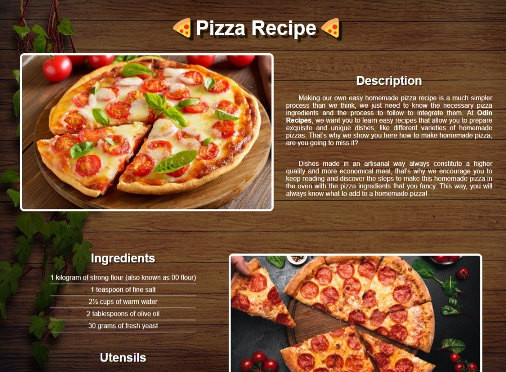

# Odin Recipes

> The website will consist of a main index page that will have links to some recipes, within each one there will be related images, their ingredients, and the method of preparation using exclusively HTML for the creation of the project.

Additional description about the project and its features.

## Built With

- Major languages: English.
- Technologies used: HTML.

## Live Demo

[Live Demo Link](https://vxnec0de.github.io/odin-recipes/)

## Getting Started

**Clone the repository in Git and run it from a browser.**

## Authors

👤 **Vanessa Carolina Rubio Cheing**

- GitHub: [@VxneC0de](https://github.com/VxneC0de)
- Instagram: [@v_rc20](https://www.instagram.com/v_rc20/)
- LinkedIn: [LinkedIn](https://www.linkedin.com/in/vanessa-rubio-7b7492293/)

## 🤝 Contributing

Contributions, issues, and feature requests are welcome!

Feel free to check the [issues page](https://github.com/VxneC0de/odin-recipes/issues).

## Show your support

Give a ⭐️ if you like this project!

## Acknowledgments

- Hat tip to anyone whose code was used: I thank Google for the Information acquired for this project and Microsoft Edge for the images.
- Inspiration: https://www.recetasgratis.net/.

## 📝 License

This project is [CC0 1.0 Universal](LICENSE) licensed.